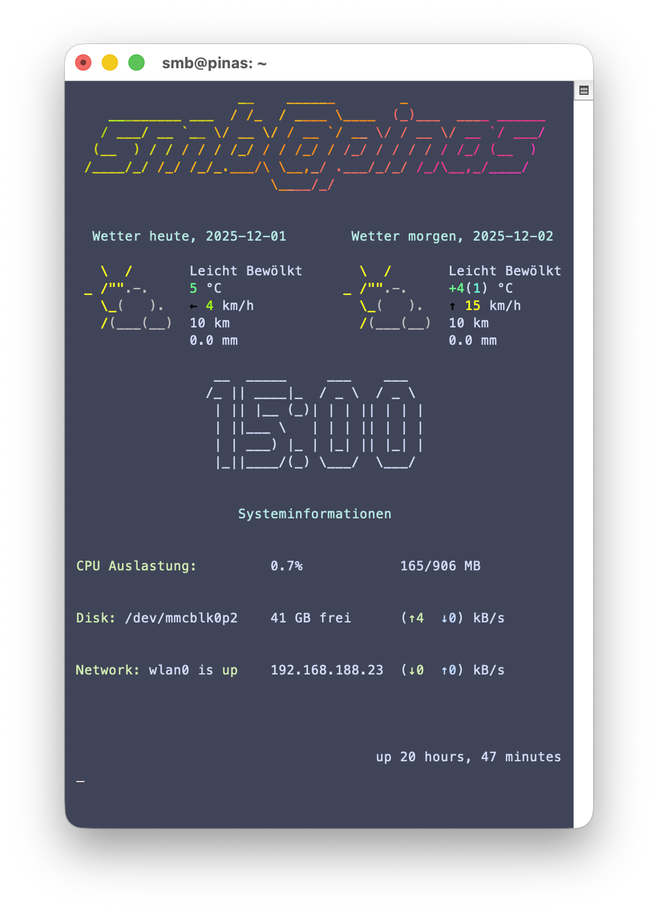

# My Raspberry Pi Dashboard

## Features
- Stylized display of user- and host-name
- Current date
- Time easily visible large and center
- Weather conditions for today and tomorrow
- CPU load and memory usage ...
- Leftover storage space and disk i/o speeds
- Internet connectivity and connection speeds

## About
This is a cool colorful dashboard I built for my Raspberry Pi 3B+ and its tiny 60x40 characters 3.5" LCD. It took me two whole days and it consists of two bash scripts:

### `fetch_weather.sh` 
Executes curl requests to [wttr.in](wttr.in) once an hour via a cronjob, in order to get the weather for today and tomorrow. It also processes the responses, so they can be displayed side-by-side on this small 60-character wide LCD screen (cutting spaces, trimming and padding).
The processed responses get saved to files so we don't have to access the internet all the time.
There are also fallback-files of older weather, in case the request fails.

### `display.sh`
Executes a whole bunch of commands and processes their responses with `grep`, `awk`, `sed` to collect the data to be displayed. Also sets the colors for everything, except the weather, which already comes shipped with color and with cute ASCII-Art. The display is set to refresh once a minute.

## Takeaways

1) __So much regex__

    Especially the first line of text in todays weather report needed a lot of work. Text would sometimes be too long or too short and misalign the first line of tomorrows weather when the two are being put side-by-side with the command `paste`.

    And I couldn't just cut the line after $n$ characters, because apparently the invisible color control-sequences also count towards the line-length with `cut`. Luckily StackOverflow user _NwDsk Veder_'s [padding function](https://stackoverflow.com/a/72068155) turned out clutch, as it doesn't only pad left or right, but also trim strings if theyre too long.
    
    Overall, figuring out the correct patterns took a lot of trial-and-error, because I don't program much in bash.

    \> I definitely got a lot better at writing regex syntax and more comfortable using `sed` and `awk`.

2) __The right refresh__

    I Initially decided against using `clean` to refresh the screen, because at that point in development I refreshed the display every 5 seconds, which caused a lot of flickering, because the whole screen has to be redrawn.

    But using `tput` to move the cursor back to the beginning and just overwriting what was previously there sometimes left behind artifacts. This was due to some of the properties having a dynamic length and not overwriting previous characters if the old string was longer than the new one.

    In the end i chose `clean` and set the refresh interval to 60 seconds, so the flickering would be manageable.

    \> A necessary tradeoff in user experience for better stability.

3) __Battle against Undervoltage__

    My Raspberry Pi hates not having enough power and spammed the terminal with its stupid _Undervoltage detected!_ warnings, which blew apart the dashboard (especially with the `tput` refresh!). I tried disabling it in software, but it just kept showing up. A proper power-supply solved the issue in the end.

    \> That should've been the first thing I tried.